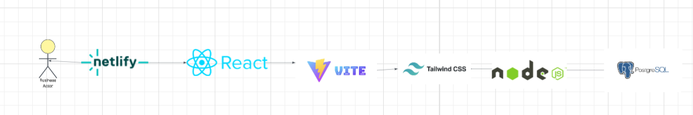

# Home Readiness Planner

website: https://is-401-group-project.vercel.app/login

The Home Readiness Planner helps aspiring homeowners move from financial uncertainty to a clear, personalized plan for buying a home. Users can enter financial details, explore affordability scenarios, and track goals toward home ownership.

## Tech Stack

- **Frontend:** React (TypeScript), Vite, Tailwind CSS, shadcn/ui
- **Backend:** Supabase (Auth + PostgreSQL)
- **Deployment:** Vercel

---

## Prerequisites

- **Node.js** (v18 or higher) — [Download](https://nodejs.org/en/download)
- **Git** — [Download](https://git-scm.com/downloads)

That's it. No PostgreSQL or pnpm required for the Supabase setup.

---

## Quick Start (Supabase)

### 1. Clone and install

```bash
git clone <repository-url>
cd IS401_Group_Project
npm install
```

### 2. Set up Supabase

1. Create a project at [supabase.com](https://supabase.com)
2. In **SQL Editor**, run the contents of `db/supabase_schema.sql`, then run `db/migrate_readiness_history.sql` for score history and financial snapshot fields
3. In **Authentication → Providers → Email**, turn **off** "Confirm email" so users can sign in immediately after signup (no email verification)
4. In **Settings → API**, copy your **Project URL** and **anon public** key

### 3. Configure environment

Create a `.env` file in the project root:

```
VITE_SUPABASE_URL=https://your-project.supabase.co
VITE_SUPABASE_ANON_KEY=your-anon-key
```

### 4. Run the app

```bash
npm run dev
```

Open **http://localhost:8080**. Sign up at `/signup` or sign in at `/login`.

---

## Using the App

- **Sign up:** Go to http://localhost:8080/signup to create an account
- **Sign in:** Go to http://localhost:8080/login
- **Goals:** After signing in, visit `/goals` to create and track savings goals (stored in Supabase)
- **Data Entry:** Use **Settings** to add income, expenses, and update your financial snapshot. Add contributions to goals on the Goals page.

---

## Alternative: npm vs pnpm

This project works with **npm** (comes with Node.js) or **pnpm**:

```bash
# Using npm (recommended if pnpm isn't installed)
npm install
npm run dev

# Using pnpm (if you have it installed)
pnpm install
pnpm run dev
```

---

## Essential Info

- **Frontend:** React SPA on port **8080**
- **Supabase:** Auth and goals use `VITE_SUPABASE_URL` and `VITE_SUPABASE_ANON_KEY`
- **No backend server needed** when using Supabase

---

## Architecture Diagram

<<<<<<< HEAD

=======


  EARS Requirements — Updated
--- Complete ---

1.The system shall display a toolbar that allows users to navigate between major sections of the application.
2. The system shall display a login interface that allows the user to enter authentication credentials.
3. When a user enters valid login credentials, the system shall authenticate the user and grant access to their account.
4. While the application is deployed online, the system shall allow users to access the application through a hosted web URL.
--- Updated / Newly Implemented ---
5. When a user accesses the goals page, the system shall display a list of real estate preparation goals that guide the user through the home-buying process.
6. When a user views their goals, the system shall allow the user to track progress on tasks related to budgeting, credit improvement, savings, and mortgage readiness.
7. When a user interacts with a goal, the system shall allow the user to mark goals or steps as complete.
8. When a user updates goal progress, the system shall save and persist the user's progress across sessions.
9. While a user navigates the application, the system shall provide structured guidance through defined goal-based steps instead of general recommendations.
--- Still In Progress / Not Fully Complete ---
10. When a user views the homepage, the system shall provide fully personalized recommendations based on the user’s financial profile and preferences.
11. When a user accesses the profile page, the system shall allow the user to update and persist detailed financial and home-buying preference information.
12. When a user saves preparation progress, the system shall generate insights or feedback based on completed and remaining goals.
